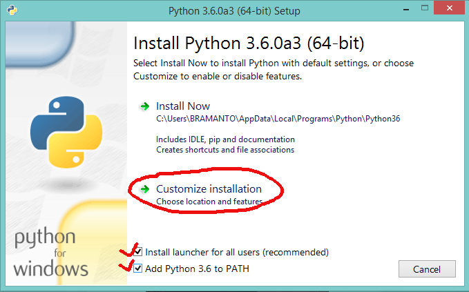
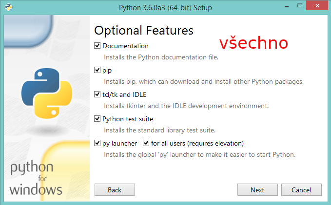
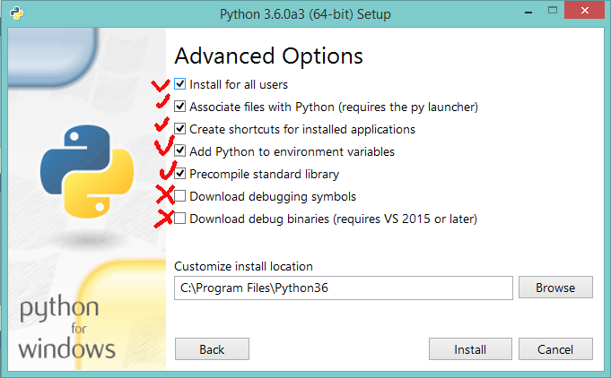

Instalace
=======================

Budeme používat [Python 3](https://docs.python.org/3/). Kromě Pythonu budeme
ale také potřebovat  některé knihovny a ještě nějaké další nástroje. 
jednoduchou instalaci celého ekosystému knihoven a nástrojů slouží například
[WinPython](https://winpython.github.io/) a jemu podobné distribuce Pythonu. 
Pokud si některý z těchto nástrojů
nainstalujete, pravděpodobně už nebude muset instalovat nic dalšího a můžete
se podívat rovnou na kapitolu
[Související nástroje](nastroje.md).
 
Následující text je určen těm, kteří chtějí vědět trošku víc nebo chtějí mít vše
pod kontrolou a rozhodnou se pro ruční instalaci jednotlivých součástí.

Python 3
-------------

Jeho instalátor si stáhnete z oficiálních stránek
<http://python.org/>. Stačí kliknout na [Downloads](https://www.python.org/downloads/).

Při instalaci zadejte **Install Launcher** a **Add Python to PATH**. 
Nainstalujte si i **pip**. Pokud nic nebudete měnit měl by se vám Python 
nainstalovat do *Program Files\Python36*

Uživatelé OS **Linux** už mají nejspíš Python3 nainstalovaný. Pokud ne, stačí 
spustit něco jako 

    apt install pytho3 idle3 python3-tk python3-venv python3-pip 

Knihovny
---------------------

Pro naši výuku, práci a také pro naše pohodlí budeme potřebovat několik knihoven.
Ty se dají snadno spravovat -- tedy (od/na)instalovat pomocí nástroje 
[pip](https://pip.pypa.io/en/stable/). Takto se dají instalovat nejen knihovny,
ale i programy napsané v Pythonu.

Stačí otevřít příkazovou řádku:

Knihovny pro matematické výpočte a vykreslování grafů jsou 
[NumPy][] a [Matplotlib][]:

    pip3 install numpy matplotlib

nebo

    pip install numpy matplotlib

Pro interaktivní práci a psaní poznámek budeme potřebovat [IPython][] a
[Jupyter][]: 

    pip3 install ipython jupyter

nebo

    pip install ipython jupyter

Pro vytváření webových stránek se hodí [Flask][]:

    pip3 install flask

Pro komunikaci s databázovým serverem [PostgreSQL][] se hodí [psycopg][]:

    pip3 install psycopg2

**Spustitelné soubory všech programů**, které jste si nainstalovali najdete
(asi:) v adresáři *Program Files\Python 3.6\scripts*. Například

[NumPy]: http://www.numpy.org/
[Matplotlib]: http://matplotlib.org
[Flask]: http://flask.pocoo.org/
[PostgreSQL]: http://postgres.cz/
[psycopg]: http://initd.org/psycopg/
[IPython]: http://ipython.org/
[Spyder]: https://pythonhosted.org/spyder/

**V Linuxu** by tento postup měl fungovat také, ale obecně není příliš dobré
přimíchat k ekosystému knihoven obsažených ve vaší distribuci knihovny přímo
stažené z up-streamu. Proto buď knihovny instalujte jen pro daného uživatele
použitím parametru `--user`

    pip3 install --user numpy matplotlib

... nebo se držte balíčků vaší distribuce

    apt install python3-numpy python3-matplotlib spyder3 ipython3 jupyter-qtconsole jupyter-notebook

... nebo tak nějak podobně.

------------------------------------------------------------------------------
[ `-->` Související nástroje](nastroje.md)
