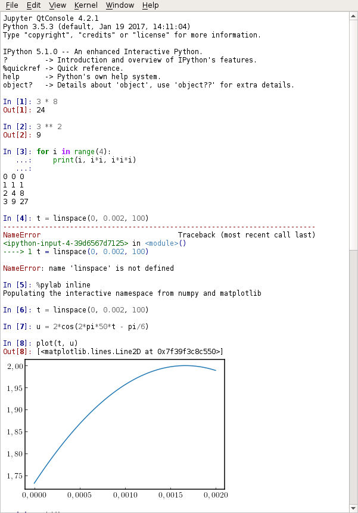

Související nástroje
=============================

Editory
------------------------

Základní instalace Pythonu už sama v sobě obsahuje jednoduché vývojové
prostředí a jednoduchou interaktivní konzolu IDLE. Toto prostředí je poměrně
jednoduché, ale rozhodně se nedá říct, že by se v něm nedalo pracovat. Existuje
ale celá řada 
[vývojových prostředí](https://cs.wikipedia.org/wiki/V%C3%BDvojov%C3%A9_prost%C5%99ed%C3%AD),
které nám mohou práci usnadnit a zpříjemnit. 
Z [dlouhého seznamu](https://wiki.python.org/moin/IntegratedDevelopmentEnvironments) 
vybírám dvě.

### VSCode/Codium

[Visual Studio Code](https://code.visualstudio.com) je brilantní open-source editor 
z dílny firmy Microsoft. Pokud do něj doinstalujete doplněk 
[ms-python.python](https://marketplace.visualstudio.com/items?itemName=ms-python.python) 
získáte vývojové prostředí, ve kterém vám s největší pravděpodobností nebude nic 
chybět.

Jen ještě doplním, že pokud by vám (stejně jako mně) vadilo, že Microsoft do 
balíčku s VSCode zabalí i telemetrii (dřív se tomu říkalo špehování), tak existuje 
projekt [Codium](https://vscodium.com/), který tímto neduhem netrpí. Codium má 
marketplace nasměrovaný trošku [jinam](https://open-vsx.org/extension/ms-python/python).

### PyCharm

[PyCharm]: https://www.jetbrains.com/pycharm/

[PyCharm][] je profesionální vývojové
prostředí. Je dostupný ve placené variantě *Professional* a v open-source
variantě *Community*. Jádro je stejné,
[ale](https://www.jetbrains.com/pycharm/features/editions_comparison_matrix.html)
profesionální verze obsahuje podporu různých technologií (nejen) pro vývoj
webu.

Studenti a učitelé mohou [PyCharm][] používat zdarma, ale jen pro výukové účely.

Jupyter
-------------

[Jupyter]: https://jupyter.org/
[Jupyter notebook]: https://nbviewer.jupyter.org/

[Jupyter][] je interaktivní Python příkazové prostředí orientované zejména 
na zpracování a vizualizaci dat. Velice dobře se hodí jako interaktivní 
konzola.
Je součástí distribuce [WinPython](https://winpython.github.io/).

    pip install jupyterlab

nebo postaru

    pip install ipython jupyter
    pip install qtconsole
    pip install pyqt

Jupyter obsahuje několik modulů. `jupyter console` a `jupyter qtconsole`
poskytují interaktivní příkazové prostředí. Rozdíl je jen v tom, že `console`
běží v příkazovém řádku, kdežto `qtconsole` je grafický program s klikacím menu.

Velice zajímavým nástrojem je [Jupyter notebook][]. Ten běží jako aplikace 
ve webovém prohlížeči. Umožňuje velice efektivně propojit psaní textu,
poznámek a vkládání obrázků se zpravováním dat a  programováním v Pythonu.

Takový notebook potom může vypadat třeba takto:
  * [jedna](https://github.com/tlapicka/IPythonNotebooks/blob/master/Matplotlib--zakladni_myslenky_postupy.ipynb)
  * [dva](https://github.com/tlapicka/IPythonNotebooks/blob/master/Harmonicka_analyza--lichobeznik.ipynb)
  * [tři](https://github.com/tlapicka/IPythonNotebooks/blob/master/Aliasing.ipynb)

------------------------------------------------------------------------------
[Instalace `<--` ](instalace.md) | [ `-->` Git a GitHub](git.md)
